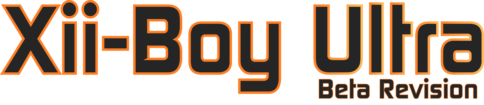
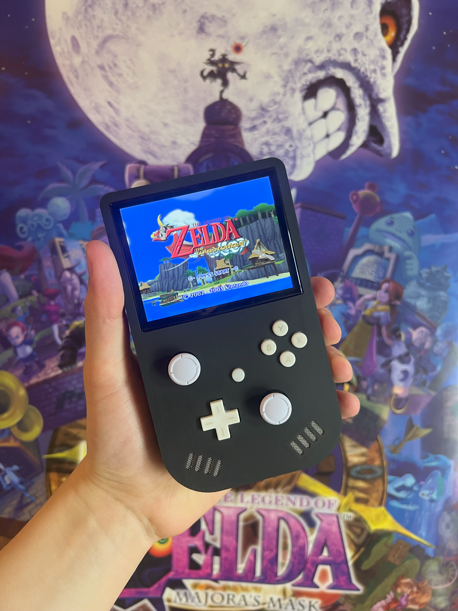
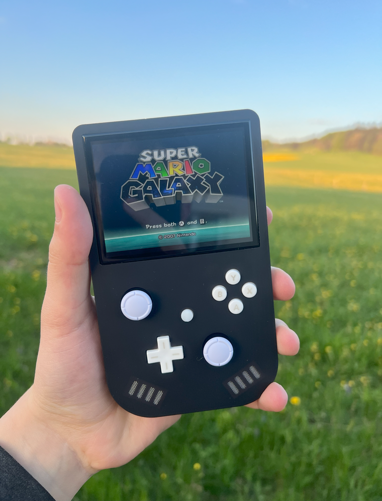

<picture>
  <source media="(prefers-color-scheme: dark)" srcset="Images/XBU-BR-Gradient.png" width="800">
  
</picture>
  
  

The Xii-Boy Ultra is a small and compact portable Wii using a vertical layout.
This third revision offers all the latest fonctionnalities, as long as the WireFree system, which allows easily assemble and dissasemble the system without solder iron, just a screwdriver.

Everything has been approved an updated to receive the last 4LayerTechnologies PCB, including PMS2 which allows showing the battery level at any time, as long as the RVL-DD for the best video quality / compatibility possible.

It also integrates a brand new analog trigger system using Nintendo Switch joysticks, the WiFi module for online game, Bluetooth to connect the original WiiMote controllers, and more!
Check out this thread for further informations: [Xii-Boy Ultra BETA Release Thread](https://bitbuilt.net/forums/index.php?threads/the-xii-boy-ultra-v3-beta-release.6918/)

⚠️ THIS BETA REVISION MIGHT CONTAIN ISSUES, MISTAKES OR ELSE. ⚠️

# Parts
All the needed parts are listed in the [Xii-Boy Ultra Parts list](https://github.com/Xenii1642/Xii-Boy-Ultra/blob/main/Parts.pdf)
Most of the parts come from Aliexpress, which might not be idea due to the recent tarrifs modifications. If you find some parts on another website, please let me know 👍

🔋For the batteries, I personally recommend those: [Recommended XBU Batteries](https://www.akkuteile.de/samsung-inr18650-35e-3-6v-3-7v-3500mah-pluspol-flach_100631_3391)
There is plenty of website that sell batteries. You should aquire them from a source you're confident with. If you live in Europe, I highly recommend [Akkuteile](https://www.akkuteile.de/). 
It's a German website and I always been pleased by their services.

You'll also noticed that the 40 pins ribbon cable might be replaced by the [40p Shielded FFC](https://github.com/Xenii1642/Xii-Boy-Ultra/blob/main/PCB/Gerbers/Shielded%20FFC.zip) I designed due to the interferance issues I had with the normal one.

⚠️ Be careful to buy them from a reliable source to avoid contracts. Fake batteries can be extremly dangerous. ⚠️

# PCBs
All the PCBs files are availble in the [PCB section](https://github.com/Xenii1642/Xii-Boy-Ultra/tree/main/PCB)
If you just want to order them, you can use the [Gerber files](https://github.com/Xenii1642/Xii-Boy-Ultra/tree/main/PCB/Gerbers). Multiple manufacters work, but I suggest [JLCPCB](https://jlcpcb.com/) for that build.

You can also make edits using the [Kicad 9 files](https://github.com/Xenii1642/Xii-Boy-Ultra/tree/main/PCB/KiCad%209%20Files).

For the components, everything is listed in the [PCB BOM File](https://github.com/Xenii1642/Xii-Boy-Ultra/blob/main/PCB%20BOM.pdf). For the moment, there are only the Digikey links, I haven't found all the parts on Mouser yet.

Ordering PCB is a pretty important step, and you should really put the correct settings while ordering, otherwise you could run into issues.
For example, even though ENIG cover is more expensive, it's absolutly nessessary for the Controller PCB. Otherwise, the buttons won't respond well, and might not work anymore after 3 months.

Here is a list of every settings per board:
### [**Main PCB (XBU-001)**:](https://github.com/Xenii1642/Xii-Boy-Ultra/blob/main/PCB/Gerbers/Main%20PCB.zip)
- Material: FR4
- Specify Stackup: YES
- Stackup profile: JLC04161H-7628
- Thickness: 1.6mm
  
### [**Xii-DD (XBU-002)**:](https://github.com/Xenii1642/Xii-Boy-Ultra/blob/main/PCB/Gerbers/Xii-DD.zip)
- Material: FR4
- Thickness: 1.2mm
  
### [**Controller PCB (XBU-003)**:](https://github.com/Xenii1642/Xii-Boy-Ultra/blob/main/PCB/Gerbers/Controller%20PCB.zip)
- Material: FR4
- Thickness: 1.6mm
- Surface finish: ENIG

### [**Xii-Flex Ultra (XBU-004)**:](https://github.com/Xenii1642/Xii-Boy-Ultra/blob/main/PCB/Gerbers/Xii-Flex%20Ultra.zip)
- Material: Flex
- Thickness: 0.12mm (💡0.11mm also works, but it's way riskier and more fragile according to some people. I personnaly didn't notice a lot of differences.)
- Stiffener: YES, Polyimide 0.2mm

### [**Trigger PCB (XBU-005)**:](https://github.com/Xenii1642/Xii-Boy-Ultra/blob/main/PCB/Gerbers/Trigger%20PCB.zip)
- Material: FR4
- Thickness: 1.6mm

### [**Xii-Strip (XBU-006)**:](https://github.com/Xenii1642/Xii-Boy-Ultra/blob/main/PCB/Gerbers/Xii-Strip.zip)
- Material: FR4
- Thickness: 0.8mm
- Surface finish: ENIG 

### [**40p Shielded FFC (XBU-007)**:](https://github.com/Xenii1642/Xii-Boy-Ultra/blob/main/PCB/Gerbers/Shielded%20FFC.zip)
- Material: Flex
- Thickness: 0.12 (💡For that baord, 0.11mm also works well)
- Stiffener: YES, Polyimide 0.2mm

You can also change the color if you want, but you shouldn't change anything else if you're not sure what you're doing.

# Case
The 3D files are all available in the [3D Section](https://github.com/Xenii1642/Xii-Boy-Ultra/tree/main/3D).
However, they are some differences between some files. 
First, there are two different kind of files.
[STL](https://github.com/Xenii1642/Xii-Boy-Ultra/tree/main/3D/STL) are classic 3D files. They can be use for ordering, or directly 3D printing through a slicer software. They are considered as "fabrication files" meaning they can almost not be editable.
[STEP](https://github.com/Xenii1642/Xii-Boy-Ultra/tree/main/3D/STEP) can also be used in a slicer or for ordering, but it also allows making changes and edits on the shell. 

On top of that, there are also two versions of the top shell:
### **FDM**:
If you have a classic FDM 3D Printer, or planned printing the case on one, you should use the [FDM](https://github.com/Xenii1642/Xii-Boy-Ultra/tree/main/3D/STL/FDM) version of the file.
The main change is the screen tolerance, which isn't the same on FDM. This version only use a Friction Fit technology, and the 3D printed layers help the screen to get stuck in place.

### **Resin & SLS**:
If you planned ordering the case through [JLC3DP](https://jlc3dp.com/) or [PCBWay](https://www.pcbway.com/), or simply printing one yourself with a resin printer, you should use the [Resin & SLS case](https://github.com/Xenii1642/Xii-Boy-Ultra/tree/main/3D/STL/Resin%20%26%20SLS).
Considering the shell is much smoother here, normal Friction Fit doesn't work well, and the screen might pop off pretty easily.
To avoid that, those versions have a Super Friction Fit technology, which mimic the FDM layers and make the screen strongly attached into the shell.

The 3D files are also available on my Printable account [Xii-Boy Ultra 3D files - Printables](https://www.printables.com/model/1301431-xii-boy-ultra-wii-portable)

You can also find the Xii-Boy Ultra stands in the [stands folder](https://github.com/Xenii1642/Xii-Boy-Ultra/tree/main/3D/STL/Stands) or on my Printables account: [Xii-Boy Ultra stands - Printables](https://www.printables.com/model/1307105-xii-boy-ultra-stands)

One of them has a slot for the [XiiSBar](https://github.com/Xenii1642/XiiSBar), which allows you to play game with the IR pointer. 

# Software
Xii-Boy Ultra runs on RVLoader, a wonderful homebrew app made by Aurelio over the BitBuilt forum. However, it needs to be slightly modified for the Xii-Boy Ultra features.

You'll find all the new files in the [Software](https://github.com/Xenii1642/Xii-Boy-Ultra/tree/main/Software) section of that repository.

⚠️ Those files are tempoary. They will be included in the next RVLoader update and will be deleted once it's ready. ⚠️
### [GCPlus2.0Update.hex](https://github.com/Xenii1642/Xii-Boy-Ultra/blob/main/Software/GCPlus2.0Update.hex)
This file is used to update the GC+ 2 from [4LayerTech](https://4layertech.com/) with a new version compatible with the Xii-Boy Ultra trigger system.
To update your GC+ 2.0, simply copy / paste that file in the root of your Xii-Boy Ultra µSD card.

### [boot.dol](https://github.com/Xenii1642/Xii-Boy-Ultra/blob/main/Software/boot.dol):
This files is used to add Volume and Brightness over buttons in Gamecube games.
To add those features, simply drag and replace the original file in `/apps/Nintendont`.

### [LCDDriver.bit](https://github.com/Xenii1642/Xii-Boy-Ultra/blob/main/Software/LCDDriver.bit)
This file is used to flash the DD software when booting. The original one, present by default in RVLoader contains a little issue with i2C.
It results into random crashes and volume or brightness control interferances.
To install it, you just have to replace the original file in the root of your µSD card.

### [hud.elf](https://github.com/Xenii1642/Xii-Boy-Ultra/blob/main/Software/hud.elf)
Like boot.dol, this file is used to add Volume and Brightness over buttons in Wii games.
To add those features, simply drag and replace the original file in `/rvloader/Hiidra/modules`

Once everything has been installed, safety eject your µSD card / Xii-Boy Ultra console.
Boot it up and go to `Settings` --> `Controller` --> `Firmware Update`
If everything has been done correctly, your Xii-Boy Ultra should be udpated.
Set your `Triggers mode` to `Analog` and press `Save Config`
Reboot your device and go to `Settings` --> `Controller` --> `Buttons Tester`
You should now see all the buttons and the analog triggers working!

# General Software Setting:
- In `Power` --> `Charge Settings`, `Battery Capacity` needs to be set at 7000mAh (or the capacity of one cell *2 `3500mAh *2 = 7000mAh`)
- `Charging Current` should be set at 3520mA
- `Precharge` and `Termination current` should be set at 128mA
- `Charge Voltage` should be set at 4200mV
- In `Misc Settings`, you need to change `Status LED type:` to `Adressable Type B`
💡Don't change the rest of the Power settings
- in `Audio`, `Volume control system` needs to be set to Buttons.
💡You can adapt all the settings depends on you. I personally set the `Status LED Intensity` to 5 and the `Rumble Intensity` to 60.

💡To test all the features, you should launch a Wii and a GameCube game, to make sure everything is working fine.

# Support
The Xii-Boy Ultra is only on a BETA revision.
This means, there could be some mistakes somewhere.
Troubleshooting a whole design like this is tricky, and I might have not seen all the mistakes.
Reason why you should absolutly tell me if you notice some. 

If you think something can be improved, once again, please let me know. Those feebacks help a lot making the project better.

This BETA Revision might not be for beginners considering it requires soldering knoledge and self-deduction to assemble everything together.
For the moment, there is no assembly guide, which makes the build much trickier to make. An official guide will come soon!

To sum up, if you don't have the knowledge for assembling that revision, you should probably wait for the upcoming kits, with a dedicated assembly guide.

If you see anything wrong or weird on the design, or if you have any suggestion, please let me know!

Have fun! 
